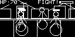
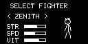
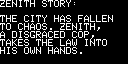

# Sticks of Rage

A technical side-scrolling beat 'em up for the **Arduboy** (monochrome handheld) and **SDL2** (Desktop). Built with a custom skeletal animation engine, *Sticks of Rage* delivers high-performance 60fps action with deep combat mechanics.


## Features

- **Custom Skeletal Engine**: Smooth, fluid animations using a lightweight skeletal system optimized for the ATmega32u4.
- **Lane-Based Combat**: Classic beat 'em up movement across 5 diverse stages.
- **Deep Roster**: 10 unique fighters with varying stats (Strength, Vitality, Walk Speed) and AI profiles.
- **Multi-Platform**: Play on original Arduboy hardware or on Desktop via SDL2.
- **Animation Editor**: Includes a desktop-based skeletal animation editor for creating and tweaking poses.

## Gallery

| Main Menu | Gameplay |
| :---: | :---: |
|  |  |

| Combat | Story |
| :---: | :---: |
|  |  |

## Roster

| Character | Role | Style | Description |
| :--- | :--- | :--- | :--- |
| **ZENITH** | Playable | Balanced | A disgraced cop taking the law into his own hands. |
| **CINDER** | Playable | Rushdown | Seeking revenge after his home was burned by gangs. |
| **GOLIATH** | Playable | Tank | A giant protector crushing any gang in his path. |
| **VOLT** | Enemy | Zoner | Long-range specialist with high utility. |
| **KAGE** | Enemy | Rushdown | Fast and lethal shadow warrior. |
| **SIREN** | Enemy/Boss | Balanced | Versatile fighter with strong defensive options. |
| **DRIFT** | Enemy/Boss | Balanced | Agile combatant focused on momentum. |
| **TUSK** | Enemy/Boss | Tank | Heavy hitter with massive endurance. |
| **JADE** | Enemy/Boss | Rushdown | Precise and rapid-fire martial artist. |
| **ECHO** | Final Boss | Zoner | Master of space and timing. |

## Stages

1. **THE CITY**: The fallen urban sprawl.
2. **THE PARK**: A dangerous natural refuge.
3. **THE FACTORY**: Cold industrial combat.
4. **THE WASTELAND**: Burning desert heat.
5. **THE FINAL CITY**: The heart of the syndicate.

## Controls

### Arduboy / Desktop (SDL2)
- **D-Pad / Arrow Keys**: Move (Double tap to Dash)
- **A / Z**: Punch / Confirm
- **B / X**: Kick / Back
- **Down + A/B**: Ducking Attacks
- **Up + A+B**: Special Move (Consumes Special Meter)

## Building and Running

### Prerequisites

- **Arduino**: `arduino-cli` with the `arduboy:avr` core and `Arduboy2` library.
- **Desktop**: `libsdl2-dev` installed for SDL2 support.

### Using the Makefile

- **Compile for Arduboy**:
  ```bash
  make compile
  ```
- **Upload to Arduboy**:
  ```bash
  make upload
  ```
- **Run on Desktop (SDL2)**:
  ```bash
  make sdl
  ./sticksofrage_sdl
  ```
- **Run Animation Editor**:
  ```bash
  make editor
  ./stickfighter_editor
  ```

## License

This project is licensed under the **MIT License**. See the `LICENSE` file for details.
